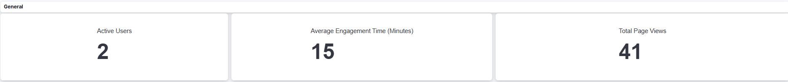

# Blog Website Real User Monitoring Dashboard (RUM)

## Project Overview

This project aims to develop a Real User Monitoring (RUM) Dashboard for a blog website using advanced analytics tools. The dashboard centralizes data and allows real-time analysis of user interactions to improve decision-making.

## System Architecture

## Setting Up the Blog

This project is based on the MERN blog repository. For detailed setup instructions, visit [GitHub - berthutapea/mern-blog-v2](https://github.com/berthutapea/mern-blog-v2).

## Objectives

- **Data Dashboard Creation**: Centralize collected data and analyze real-time user interactions.
- **Real-Time Analysis**: Use Google Analytics 4 and Elasticsearch to capture and analyze data, improving user experience.
- **Informed Decision-Making**: Provide an intuitive interface for visualizing key data metrics.

## Technologies Used

- **Google Analytics 4**: For detailed event tracking and user interaction analysis.
- **Elasticsearch**: For storing and quickly analyzing large datasets.
- **Kibana**: For data visualization and creating interactive dashboards.

## Development Environment

- **Docker**: To create and manage application containers, ensuring consistency across development, testing, and production.

## Setup with Docker Compose

### Version

- **3.8**

### Services

- **Elasticsearch**: 
  - Image: `elasticsearch:8.9.0`
  - Ports: `9200:9200`
  - Volumes: `es_data:/usr/share/elasticsearch/data`
  - Networks: `esnet`

- **Kibana**:
  - Image: `kibana:8.9.0`
  - Ports: `5601:5601`
  - Networks: `esnet`
  - Depends on: Elasticsearch

### Volumes

- `es_data`: Persistent storage for Elasticsearch data.

### Networks

- `esnet`: Custom Docker network for service communication.

## Features

- **Full-Text Search**: Fast and relevant search capabilities.
- **Scalability**: Easily add nodes for large data volumes.
- **Real-Time Data Analysis**: Monitor logs and visualize data effectively.

## Dashboard Screenshots

- **General Metrics**:
  

- **Page views and Demographic data**:
  

- **API Calls and Task Results**:
  

- **Tech**:
  

